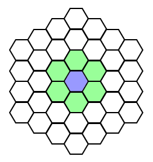
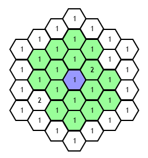
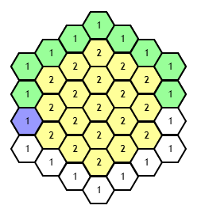
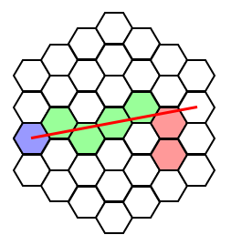

# BHex.js
JavaScript library for working with Hexagons and grids. This library does not draw grids for you, but simply sets it up for you to use your own prefered way of drawing.

## BHex.js
BHex.js is the core library for creation and calculation of a Hexagon grid.

This will give you a new cricular grid with radius of 3 (excluding the center piece), giving you a total of 37 hexagons (including center piece).
```
var grid = new BHex.Grid(3);
```


### Interia / Blocked hexagons
BHex.js also supports inertia (or movement speed/cost) and blocked hexagons, defined by `cost` on your hexagon. By default all hexagons have a cost of 1 and no hexagon should never have a cost lower than 1. Floating values are also supported, as long as they are higher than 1.
Blocked hexagons are defined by the `blocked` variable on your hexagon.

### More examples

#### Get hexagon
Simply returns a hexagon at a specific position.
```
hex = grid.getHexAt(new BHex.Axial(0, 0));
```

#### Neighbors
Get the neighboring hexagons. This does not care if a hexagon is blocked or not.



```
grid.getNeighbors(new BHex.Axial(0, 0));
grid.getNeighbors(hex);
```
A hexagon inherits from BHex.Axial, so whenever you should pass a BHex.Axial you can also just pass in a hexagon like above.

#### Range
*Note: Requires BinaryHeap.js*



Get all the hexagons available within a specific range. The hexagon in the first argument is not included in this result.
```
grid.getRange(new BHex.Axial(0, 0), 2);
```

#### Path finding
*Note: Requires BinaryHeap.js*



Find the shortest path from A to B using the A* algorithm.
```
grid.findPath(new BHex.Axial(-3, 2), new BHex.Axial(3, -2));
```

#### Distance
Get the distance between two hexagons, ignoring if a hexagon is inertia or blocked. 
```
grid.getDistance(new BHex.Axial(-3, 2), new BHex.Axial(3, -2));
```
*To get the distance with inertia and blocked hexagons taken into account use* `grid.findPath(start, end).length` *instead.*

#### Line of sight



Gets all the hexagons between 2 points until blocked. (To get field of view you could use this by checking against all the outer hexagons on the grid.)
```
grid.getLine(new BHex.Axial(-3, 2), new BHex.Axial(3, -2));
```


## BHex.Drawing.js
BHex.Drawing.js will help you prepare your grid for drawing and help you with operations regarding your grid such as finding the hexagon at a specific cursor position.

```
// Create the grid as before.
var grid = new BHex.Grid(2);

// Setup options: Size of the a single side, orientation (or PointyTop) and where the center of the grid should be.
var options = new BHex.Drawing.Options(30, BHex.Drawing.Static.Orientation.FlatTop, new BHex.Drawing.Point(0, 0));

// Creates the object for drawing.
var drawing = new BHex.Drawing.Drawing(grid, options);
```
Each hexagons in your grid will now have a center and an array of 6 corners which you can use for drawing your hexagon grid.

### More examples

#### Get a hexagon at a specific pixel position, such as the position of your cursor.
```
drawing.getHexAt(BHex.Drawing.Point(50, 75));
```

## BinaryHeap.js
This helper library is an implementation by [bgrins](https://github.com/bgrins/javascript-astar), based on an implementation by [Marijn Haverbeke](http://eloquentjavascript.net/1st_edition/appendix2.html).
It's needed for the algorithms used in `grid.getRange` and `grid.findPath`. 

## JSDoc
Both BHex.js and BHex.Drawing.js is fully commented and documented.

## Credits
All the algorithms are based on Amit Patel's blogpost on [Hexagonal Grids](http://www.redblobgames.com/grids/hexagons/), if you're interested in the theory behind hexagons, be sure to check that out. Also check out his posts [Introduction to A*](http://www.redblobgames.com/pathfinding/a-star/introduction.html) and [Implementation of A*](http://www.redblobgames.com/pathfinding/a-star/implementation.html) to get more into detail on pathfinding (`grid.getRange` and `grid.findPath`). Both of those posts are based on rectangular grids, but the theory is the same for hexagonal grids.
